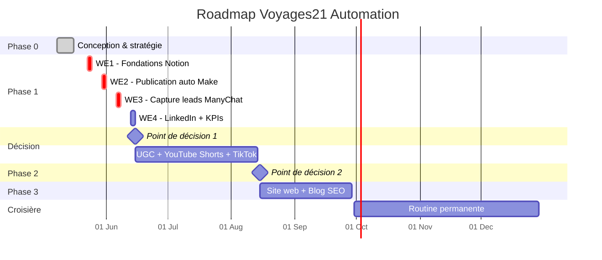

# 🗺️ PLAN DE PROJET — Voyages21 Automation

**Document de référence unique. Tout ce qu'il faut savoir et faire est ici.**

📍 **Dernière mise à jour :** 2026-05-16
🔗 **Lien permanent :** https://github.com/karimzoubdane-debug/voyages21/blob/claude/debug-chatbot-error-lsgD1/PLANNING.md

---

## 🎯 VISION (en 1 phrase)

> Mettre en place un système d'automatisation simple et durable qui crée, publie et capture des leads sur Instagram, Facebook et LinkedIn pour Voyages21 — en exigeant moins d'une heure de travail par semaine après la mise en place.

---

## 📊 OBJECTIF FINAL (mesurable)

D'ici **le 30 septembre 2026**, atteindre :

| Indicateur | Cible |
|---|---|
| Posts publiés automatiquement | **150+** sur les 3 plateformes |
| Leads capturés via ManyChat | **100+** dans Google Sheet |
| Réservations attribuables au système | **15+** voyages vendus |
| Temps de travail hebdomadaire | **< 1 heure** |
| Investissement total outils | **< 60 € / mois** |

---

## 📍 ÉTAT ACTUEL (où on en est)

**Phase actuelle :** 🟢 Phase 1 — Week-end 1 EN COURS

### Progression globale

```
PHASE 0  ██████████████████████████████  100% ✅
PHASE 1  █░░░░░░░░░░░░░░░░░░░░░░░░░░░░░    3%
PHASE 2  ░░░░░░░░░░░░░░░░░░░░░░░░░░░░░░    0%
PHASE 3  ░░░░░░░░░░░░░░░░░░░░░░░░░░░░░░    0%
```

### 📝 Journal d'exécution

| Date | Action | Statut |
|---|---|---|
| 2026-05-16 | A1 — Création page "Voyages21 — Espace projet" dans Notion | ✅ Validé |

✅ Stratégie définie (analysée 12 sources)
✅ Stack d'outils choisi (Notion + Claude + Make + ManyChat + Canva)
✅ Scénario final validé (`SCENARIO_FINAL.md`)
✅ Plan progressif acté
🟢 **WE1 démarré — A1 fait, A2 en cours**

**Prochaine action :** A2 — Nettoyer la page par défaut Notion

---

## 🗺️ TRAJECTOIRE — Vue d'ensemble



> 💡 Ce diagramme s'affiche en **visuel coloré** quand tu ouvres ce fichier sur GitHub.

---

## 🗺️ TRAJECTOIRE — 4 PHASES (détail texte)

---

## 🟢 PHASE 1 — LANCEMENT (4 week-ends)

**Dates cibles :** 23 mai → 14 juin 2026
**Objectif phase :** publier automatiquement sur 3 plateformes + capturer des leads
**Critère de succès :** 1 lead qualifié arrive dans la Google Sheet sans que je le touche

### 📋 Week-end 1 — Fondations Notion
**Date cible : 23-24 mai 2026** — Durée : 4h

- [ ] Créer compte Notion gratuit
- [ ] Créer base "Calendrier éditorial Voyages21" (7 colonnes : Titre, Contenu, Image, Date, Plateforme, État, Lead capture)
- [ ] Définir les 3 piliers de contenu avec Claude (Inspiration / Éducation / Promo)
- [ ] Générer 4 semaines de contenu avec Claude (28 posts)
- [ ] Coller les 28 posts dans Notion + photos (sources : tes archives + Pexels + UGC)
- [ ] Statut "Brouillon" sur tous
- [ ] **Test :** je peux voir mon calendrier sur mobile via l'app Notion

🎯 **Livrable WE1 :** 28 posts prêts dans Notion (rien n'est encore publié).

---

### 📋 Week-end 2 — Publication automatique
**Date cible : 30-31 mai 2026** — Durée : 4h

- [ ] Passer Instagram en compte Business (gratuit, dans les paramètres)
- [ ] Lier Instagram Business à une Page Facebook Pro (créer la page si besoin)
- [ ] Créer compte Make.com gratuit
- [ ] Connecter Notion à Make (API key Notion)
- [ ] Connecter Instagram + Facebook à Make
- [ ] Construire scénario Make : Notion (Programmé + heure proche) → Routeur → Publication
- [ ] **Test grandeur nature :** passer 1 post de Brouillon → Programmé et observer
- [ ] Si OK : programmer toute la semaine 1
- [ ] Statut passe automatiquement à "Publié" après chaque publication

🎯 **Livrable WE2 :** la 1ère semaine de contenu sera publiée automatiquement.

---

### 📋 Week-end 3 — Capture des leads
**Date cible : 6-7 juin 2026** — Durée : 3h

- [ ] Créer compte ManyChat gratuit + connecter Instagram Business
- [ ] Créer séquence "SAHARA" (mot-clé commentaire → DM → 3 questions → lead)
- [ ] Préparer PDF "Programme Sahara 5 jours" sur Canva
- [ ] Créer séquence "MARRAKECH" sur même modèle
- [ ] Créer Google Sheet "Leads Voyages21" (colonnes : nom, email, tel, source, date, statut)
- [ ] Connecter ManyChat → Google Sheet
- [ ] Configurer notification WhatsApp à chaque nouveau lead
- [ ] **Test :** un ami commente "SAHARA" sur un de tes posts → vérifier que le DM arrive et que le lead apparaît dans la Sheet

🎯 **Livrable WE3 :** chaque commentaire mot-clé devient un lead automatiquement.

---

### 📋 Week-end 4 — Affiner + LinkedIn
**Date cible : 13-14 juin 2026** — Durée : 2h

- [ ] Ajouter LinkedIn dans le scénario Make
- [ ] Créer page Notion "Tableau de bord KPI" (compteur posts, leads, réservations)
- [ ] Revue des 4 premières semaines : qu'est-ce qui a marché ?
- [ ] Générer 4 nouvelles semaines de contenu avec Claude
- [ ] Programmer le prochain mois

🎯 **Livrable WE4 :** système complet en autopilote. Tu peux confier à un assistant.

---

### ✅ Critères pour valider la PHASE 1
- [ ] 28+ posts publiés automatiquement sans intervention manuelle
- [ ] Au moins 5 leads qualifiés capturés via ManyChat
- [ ] Tu as travaillé moins de 13h au total sur le projet
- [ ] Tu peux expliquer le système à un collaborateur en 10 minutes

---

## 🚦 POINT DE DÉCISION 1 (après Phase 1)

📅 **Date : 15 juin 2026**

**Question :** Le système Phase 1 fonctionne-t-il vraiment ?

| Résultat | Décision |
|---|---|
| ✅ Oui, tout publie + 5+ leads | → Passer à Phase 2 |
| ⚠️ Ça publie mais peu de leads | → Affiner ManyChat 2 semaines avant Phase 2 |
| ❌ Ça ne marche pas | → STOP. Diagnostiquer avec Claude avant de continuer |

---

## 🟡 PHASE 2 — EXTENSION (6-8 semaines)

**Dates cibles :** 15 juin → 15 août 2026
**Objectif phase :** ajouter YouTube Shorts + TikTok + base UGC

### 📋 Milestones Phase 2

- [ ] **Stratégie UGC** : créer hashtag #Voyages21Morocco + lancer campagne auprès des clients
- [ ] **YouTube Shorts** : ajouter dans Make, recycler les Reels Instagram
- [ ] **TikTok** : ajouter dans Make
- [ ] **NotebookLM** : intégrer la veille hebdo (concurrents + tendances Maroc)
- [ ] **3e séquence ManyChat** : "SUR-MESURE" pour les demandes personnalisées
- [ ] **Première analyse de performance** : quels posts marchent le mieux ?

🎯 **Livrable Phase 2 :** présence sur 5 plateformes + 30 photos UGC en bibliothèque + 50+ leads.

---

## 🚦 POINT DE DÉCISION 2 (après Phase 2)

📅 **Date : 15 août 2026**

**Question :** Le ROI est-il prouvé ?

| Résultat | Décision |
|---|---|
| ✅ Réservations attribuables au système | → Passer à Phase 3 (site/SEO) |
| ⚠️ Beaucoup de leads, peu de conversions | → Améliorer le funnel WhatsApp avant Phase 3 |
| ❌ Pas de réservations | → Revoir la stratégie de promo |

---

## 🟠 PHASE 3 — SITE WEB + SEO (3-6 mois)

**Dates cibles :** 15 août → 30 septembre 2026 (et au-delà)
**Objectif phase :** activer le site web et le blog pour le long terme

### 📋 Milestones Phase 3

- [ ] Site web prêt (côté technique)
- [ ] Page "Circuits" simple (sans tout le catalogue, juste 5 phares)
- [ ] Connexion Instagram → site (badge, lien bio)
- [ ] Blog activé (WordPress / Webflow / autre)
- [ ] Stratégie SEO mots-clés Maroc (avec Claude ou outil dédié)
- [ ] 1 article SEO/semaine (rédigé par Claude, validé par toi)
- [ ] Auto-publication article → posts sociaux (Make + RSS)

🎯 **Livrable Phase 3 :** trafic SEO commence à arriver (résultats visibles à M+6).

---

## 🔄 PHASE CROISIÈRE — Routine permanente

À partir de **fin septembre 2026** :

### Routine hebdomadaire (1h max)
- **Lundi 9h** : 20 min de veille NotebookLM + Instagram Explore + Google Trends
- **Dimanche soir** : 30 min de génération de la semaine suivante avec Claude
- **Vendredi soir** : 10 min de revue KPIs

### Routine mensuelle (1h)
- Analyse des 3-4 posts top performance
- Ajustement de la stratégie pour le mois suivant
- Réponse aux leads "tiède" via WhatsApp

---

## 📚 DOCUMENTS DE RÉFÉRENCE

| Document | Rôle |
|---|---|
| 📄 **PLANNING.md** *(ce document)* | **GPS du projet** — vision, trajectoire, état |
| 📄 `SCENARIO_FINAL.md` | Le "comment" détaillé du système |
| 📄 `STRATEGIE_AUTOMATISATION_CONTENU.md` | Toutes les analyses des 12 vidéos/articles |
| 📄 `FICHE_VIDEOS_A_ANALYSER.md` | Pour ajouter de nouvelles vidéos plus tard |

Tout est sur GitHub : https://github.com/karimzoubdane-debug/voyages21/tree/claude/debug-chatbot-error-lsgD1

---

## 📊 TABLEAU DE BORD VISUEL

### Vue Kanban (à mettre à jour à la main)

```
┌──────────────────┬───────────────────┬──────────────────┐
│   📥 À FAIRE      │   🔄 EN COURS     │   ✅ TERMINÉ     │
├──────────────────┼───────────────────┼──────────────────┤
│  WE2 Make         │  WE1 Notion       │  Phase 0          │
│  WE3 ManyChat     │                   │  Stratégie        │
│  WE4 LinkedIn     │                   │  Scénario final   │
│                  │                   │  Planning créé    │
│  Photos dossier  │                   │  A1: Page projet  │
│  Liste concurr.  │                   │                  │
└──────────────────┴───────────────────┴──────────────────┘
```

### Indicateurs clés (à mettre à jour chaque semaine)

| Métrique | Cible Phase 1 | Actuel | Statut |
|---|---|---|---|
| Posts publiés auto | 28 | 0 | 🔴 |
| Leads capturés | 5 | 0 | 🔴 |
| Coût mensuel | < 30 € | 0 € | ✅ |
| Heures travail / sem. | < 1h | - | ⏳ |

---

## ✋ RÈGLES DU PROJET

1. **Ne pas passer au week-end suivant** si le précédent n'est pas terminé ET testé
2. **Ne pas ajouter d'outil** sans le valider contre les critères du `SCENARIO_FINAL.md`
3. **Tester chaque étape en conditions réelles** (un vrai post, un vrai DM)
4. **Mesurer** : sans Sheet de leads et tableau de bord, on ne sait pas si ça marche
5. **L'authenticité avant la quantité** : mieux vaut 5 posts vrais que 20 IA générique

---

## 🚀 PROCHAINE ACTION (à faire MAINTENANT)

📅 **D'ici le 22 mai 2026** (avant le Week-end 1) :

- [ ] Rassembler **toutes les photos/vidéos** déjà existantes (téléphone, ordinateur, ancien matériel) → créer un dossier Google Drive "Photos Voyages21"
- [ ] Lister **5 concurrents** dont tu suis le contenu (URL Instagram)
- [ ] Choisir si tu démarres le **23 mai** ou repousser à une autre date

Dis-moi quand c'est fait, et on attaque la **Phase 1 - Week-end 1 ensemble**.

---

## 📈 SUIVI EN CONTINU

À chaque étape franchie, je mets à jour ce document avec :
- Date de réalisation effective
- Ce qui a marché / ce qui a coincé
- Les ajustements à faire pour la suite

Le projet a **un cap clair** et **un cadre simple**. Pas d'improvisation, pas de surcouche.

**Mantra :** *"Mieux vaut un système simple qui tourne 12 mois qu'une usine à gaz qui meurt en 3 semaines."*
