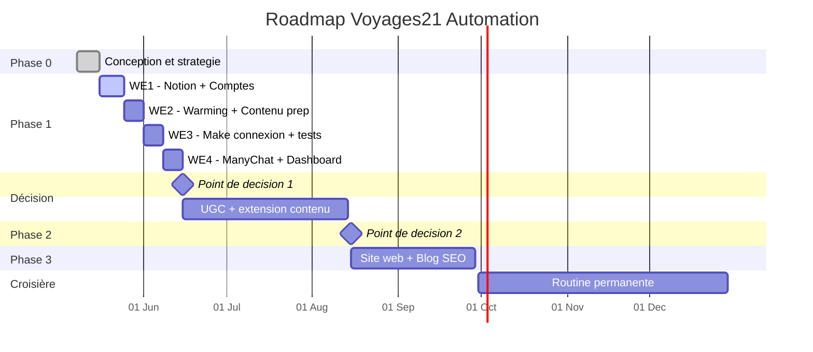

# PLAN DE PROJET - Voyages21 Automation

Document de référence unique. Tout ce qu'il faut savoir et faire est ici.

Dernière mise à jour : 2026-05-16
Lien permanent : https://github.com/karimzoubdane-debug/voyages21/blob/claude/debug-chatbot-error-lsgD1/PLANNING.md

Pour reprendre ce projet dans une autre conversation, voir REPRENDRE_LE_PROJET.md

---

## VISION (en 1 phrase)

Mettre en place un système d'automatisation simple et durable qui crée, publie et capture des leads sur Facebook, Instagram, LinkedIn, TikTok et YouTube Shorts pour Voyages21 - en exigeant moins d'une heure de travail par semaine après la mise en place.

---

## OBJECTIF FINAL (mesurable)

D'ici le 30 septembre 2026, atteindre :

| Indicateur | Cible |
|---|---|
| Posts publiés automatiquement | 150+ sur les 5 plateformes |
| Leads capturés via ManyChat | 100+ dans Google Sheet |
| Réservations attribuables au système | 15+ voyages vendus |
| Temps de travail hebdomadaire | moins de 1 heure |
| Investissement total outils | moins de 60 euros par mois |

---

## ÉTAT ACTUEL

Phase actuelle : Phase 1 - Week-end 1 en cours

### Progression globale

```
PHASE 0  ##############################  100% FAIT
PHASE 1  ##########....................   30%
PHASE 2  ..............................    0%
PHASE 3  ..............................    0%
```

### Journal d'exécution

| Date | Action | Statut |
|---|---|---|
| 2026-05-16 | A1 - Création page "Voyages21 - Espace projet" dans Notion | Validé |
| 2026-05-16 | A2-A10 - Création base "Calendrier éditorial" + 7 colonnes (Titre, Contenu, Image, Date, Plateforme, État, Lead capture) | Validé |
| 2026-05-16 | A11 - Nettoyage des lignes de test (2/3 lignes supprimées, 1 reste comme ligne de test) | Validé |
| 2026-05-16 | A12 - Définition du positionnement (cible 60/40, marchés DE+IT+UK+CH, ton de marque) | Validé |
| 2026-05-16 | A13 - Création MASTER_PROMPT_VOYAGES21.md (identité, audiences, tonalités, piliers, stratégie marketing phasée) | Validé |
| 2026-05-16 | Décisions cadre : Option C (5 plateformes), comptes avant Make, règle no-emoji, fichier REPRENDRE_LE_PROJET.md créé | Validé |

Stratégie définie (analysée 12 sources).
Stack d'outils choisi (Notion + Claude + Make + ManyChat + Canva).
Scénario final validé (SCENARIO_FINAL.md).
Master Prompt de marque créé.
Plan progressif acté.

Prochaine action : A14 - Création du premier compte social (Facebook Page Pro Voyages21).
Pré-requis avant A14 : réponses aux 6 questions de préparation (voir section Pré-requis ci-dessous).

---

## TRAJECTOIRE - Vue d'ensemble



---

## TRAJECTOIRE - 4 PHASES (détail texte)

```
PHASE 0 (FAIT) -> PHASE 1 -> PHASE 2 -> PHASE 3 -> CROISIÈRE
Conception     Lancement   Extension   Site/SEO   Optimisation
   100%         4 WE        6-8 sem.    3-6 mois   continu
```

---

## PHASE 1 - LANCEMENT (4 week-ends)

Dates cibles : 16 mai - 14 juin 2026
Objectif phase : publier automatiquement sur 5 plateformes + capturer des leads
Critère de succès : 1 lead qualifié arrive dans la Google Sheet sans intervention manuelle

### Week-end 1 - Fondations Notion + Comptes sociaux
Date cible : 16-24 mai 2026 (étendu sur 9 jours car création comptes prend du temps)
Durée totale : 6h

Notion (FAIT) :
- Compte Notion gratuit créé
- Base "Calendrier éditorial Voyages21" avec 7 colonnes opérationnelles
- Master Prompt Voyages21 créé et versionné sur GitHub

Comptes sociaux (À FAIRE - Action 14 en cours) :
- Pré-requis : valider les 6 questions de préparation
- Créer Facebook Page Pro "Voyages21"
- Convertir Instagram en compte Business et lier à la Page FB
- Créer LinkedIn Company Page "Voyages21"
- Créer TikTok Business Account "Voyages21"
- Créer YouTube Channel "Voyages21" (compte de marque Google)
- Habiller chaque compte : logo, bannière, bio, lien
- Publier 2-3 posts manuels par compte (warming initial)

Livrable WE1 : 5 comptes sociaux créés et habillés, prêts pour la phase de warming.

### Week-end 2 - Warming + Préparation contenu
Date cible : 25-31 mai 2026
Durée : 4h

Objectifs :
- Laisser les comptes "respirer" naturellement (Meta surveille les nouveaux comptes pendant 7-10 jours)
- Publier 4-5 posts manuels supplémentaires par plateforme pour montrer une activité organique
- Générer 4 semaines de contenu (28 posts) avec Claude en utilisant le Master Prompt
- Coller les 28 posts dans Notion + ajouter visuels
- Statuer chaque ligne en "Brouillon"

Livrable WE2 : 28 posts prêts dans Notion (rien n'est encore automatisé).

### Week-end 3 - Make connexion + Tests
Date cible : 1-7 juin 2026
Durée : 4h

Objectifs :
- Créer compte Make.com gratuit
- Connecter Notion à Make (clé API Notion)
- Connecter les 5 plateformes à Make (FB, IG, LinkedIn, TikTok, YouTube)
- Construire le scénario Make complet : Notion (Programmé + heure proche) -> Routeur par plateforme -> Publication
- Test grandeur nature : passer 1 post de Brouillon à Programmé et observer
- Si OK : programmer 1 post automatique par jour la première semaine (volume bas)
- Surveiller que Meta n'a pas flaggé le compte
- Statut passe automatiquement à "Publié" après chaque publication

Livrable WE3 : la 1ère semaine de contenu est publiée automatiquement à volume modéré.

### Week-end 4 - ManyChat + Dashboard
Date cible : 8-14 juin 2026
Durée : 3h

Objectifs :
- Créer compte ManyChat gratuit + connecter Instagram Business
- Créer séquence "SAHARA" (mot-clé commentaire -> DM -> 3 questions -> lead)
- Préparer PDF "Programme Sahara 5 jours" sur Canva
- Créer séquence "MARRAKECH" et "RAID" sur même modèle
- Créer Google Sheet "Leads Voyages21" (colonnes : nom, email, tel, source, date, statut)
- Connecter ManyChat -> Google Sheet
- Configurer notification WhatsApp à chaque nouveau lead
- Créer page Notion "Tableau de bord KPI"
- Augmenter le volume de publications automatiques à rythme normal

Livrable WE4 : système complet en autopilote. Chaque commentaire mot-clé devient un lead automatiquement.

### Critères pour valider la PHASE 1
- 28+ posts publiés automatiquement sans intervention manuelle
- Au moins 5 leads qualifiés capturés via ManyChat
- Tu as travaillé moins de 17h au total sur le projet
- Tu peux expliquer le système à un collaborateur en 10 minutes

---

## POINT DE DÉCISION 1 (après Phase 1)

Date : 15 juin 2026

Question : Le système Phase 1 fonctionne-t-il vraiment ?

| Résultat | Décision |
|---|---|
| Oui, tout publie + 5+ leads | Passer à Phase 2 |
| Ça publie mais peu de leads | Affiner ManyChat 2 semaines avant Phase 2 |
| Ça ne marche pas | STOP. Diagnostiquer avec Claude avant de continuer |

---

## PHASE 2 - EXTENSION (6-8 semaines)

Dates cibles : 15 juin - 15 août 2026
Objectif phase : ajouter base UGC + intégration NotebookLM + ads de test

Milestones Phase 2 :
- Stratégie UGC : créer hashtag #Voyages21Morocco + lancer campagne auprès des clients
- Activation NotebookLM pour veille concurrentielle hebdomadaire
- 3e séquence ManyChat : "SUR-MESURE" pour les demandes personnalisées
- Lancement test ads à 300-500 euros par mois sur le marché allemand
- Première analyse de performance : quels posts marchent le mieux ?

Livrable Phase 2 : présence stable sur 5 plateformes + 30 photos UGC en bibliothèque + 50+ leads + premiers résultats ads.

---

## POINT DE DÉCISION 2 (après Phase 2)

Date : 15 août 2026

Question : Le ROI est-il prouvé ?

| Résultat | Décision |
|---|---|
| Réservations attribuables au système | Passer à Phase 3 (site/SEO) |
| Beaucoup de leads, peu de conversions | Améliorer le funnel WhatsApp avant Phase 3 |
| Pas de réservations | Revoir la stratégie de promo |

---

## PHASE 3 - SITE WEB + SEO (3-6 mois)

Dates cibles : 15 août - 30 septembre 2026 (et au-delà)
Objectif phase : activer le site web et le blog pour le long terme

Milestones Phase 3 :
- Site web prêt (côté technique)
- Page "Circuits" simple (sans tout le catalogue, juste 5 phares)
- Connexion Instagram vers le site (badge, lien bio)
- Blog activé (WordPress / Webflow / autre)
- Stratégie SEO mots-clés Maroc (avec Claude ou outil dédié)
- 1 article SEO par semaine (rédigé par Claude, validé par toi)
- Auto-publication article vers posts sociaux (Make + RSS)

Livrable Phase 3 : trafic SEO commence à arriver (résultats visibles à M+6).

---

## PHASE CROISIÈRE - Routine permanente

À partir de fin septembre 2026 :

Routine hebdomadaire (1h max) :
- Lundi 9h : 20 min de veille NotebookLM + Instagram Explore + Google Trends
- Dimanche soir : 30 min de génération de la semaine suivante avec Claude
- Vendredi soir : 10 min de revue KPIs

Routine mensuelle (1h) :
- Analyse des 3-4 posts top performance
- Ajustement de la stratégie pour le mois suivant
- Réponse aux leads "tiède" via WhatsApp

---

## TABLEAU DE BORD VISUEL

### Vue Kanban (à mettre à jour à la main)

```
+------------------+-------------------+------------------+
|   À FAIRE         |   EN COURS        |   TERMINÉ        |
+------------------+-------------------+------------------+
|  WE2 Warming     |  WE1 Comptes      |  Phase 0          |
|  WE3 Make        |                   |  Stratégie        |
|  WE4 ManyChat    |                   |  Scénario final   |
|                  |                   |  Planning créé    |
|                  |                   |  A1: Page projet  |
|                  |                   |  A2-A10: Base+col |
|                  |                   |  A11: Nettoyage   |
|                  |                   |  A12: Position.   |
|                  |                   |  A13: Master prpt |
+------------------+-------------------+------------------+
```

### Indicateurs clés (à mettre à jour chaque semaine)

| Métrique | Cible Phase 1 | Actuel | Statut |
|---|---|---|---|
| Comptes sociaux créés | 5 | 0 | À démarrer |
| Posts publiés auto | 28 | 0 | À démarrer |
| Leads capturés | 5 | 0 | À démarrer |
| Coût mensuel | moins de 30 euros | 0 euros | OK |
| Heures travail / sem. | moins de 1h | - | À mesurer |

---

## DOCUMENTS DE RÉFÉRENCE

| Document | Rôle |
|---|---|
| PLANNING.md (ce document) | GPS du projet - vision, trajectoire, état |
| REPRENDRE_LE_PROJET.md | Mode d'emploi pour reprendre dans une autre conversation |
| MASTER_PROMPT_VOYAGES21.md | ADN de marque pour génération de contenu IA |
| SCENARIO_FINAL.md | Le "comment" détaillé du système |
| STRATEGIE_AUTOMATISATION_CONTENU.md | Toutes les analyses des 12 vidéos/articles |
| FICHE_VIDEOS_A_ANALYSER.md | Pour ajouter de nouvelles vidéos plus tard |

Tout est sur GitHub : https://github.com/karimzoubdane-debug/voyages21/tree/claude/debug-chatbot-error-lsgD1

---

## RÈGLES DU PROJET (à respecter à chaque action)

1. Pas d'emoji, pas d'icônes nulle part (côté humain à préserver - c'est ton avantage concurrentiel principal)
2. Une action à la fois, jamais plus
3. L'assistant n'avance jamais sans le GO explicite de Karim
4. L'assistant ne met à jour le GitHub que quand Karim le demande
5. Chaque action est annoncée avec une phrase qui explique son but et son objectif
6. Ne pas passer au week-end suivant si le précédent n'est pas terminé ET testé
7. Ne pas ajouter d'outil sans le valider contre les critères du SCENARIO_FINAL.md
8. Tester chaque étape en conditions réelles (un vrai post, un vrai DM)
9. Mesurer : sans Sheet de leads et tableau de bord, on ne sait pas si ça marche
10. L'authenticité avant la quantité : mieux vaut 5 posts vrais que 20 IA générique

---

## PRÉ-REQUIS - 6 QUESTIONS À VALIDER AVANT ACTION 14

Avant que la création des comptes sociaux ne démarre, valider ces 6 points :

1. As-tu déjà un compte Facebook personnel à ton nom ? (oui/non)
2. As-tu déjà un profil LinkedIn personnel à ton nom ? (oui/non)
3. As-tu déjà un compte Google (Gmail) que tu utilises pour ton activité pro ? (oui/non)
4. As-tu déjà un compte TikTok personnel à ton nom ? (oui/non)
5. As-tu un logo Voyages21 prêt à uploader comme photo de profil ? (oui/non)
6. As-tu une photo de couverture (paysage horizontal) prête ? (oui/non)

Si "oui" partout, on enchaîne immédiatement. Sinon, on prépare le manquant avant.

---

## SUIVI EN CONTINU

À chaque étape franchie, mise à jour de ce document avec :
- Date de réalisation effective
- Ce qui a marché / ce qui a coincé
- Les ajustements à faire pour la suite

Le projet a un cap clair et un cadre simple. Pas d'improvisation, pas de surcouche.

Mantra : mieux vaut un système simple qui tourne 12 mois qu'une usine à gaz qui meurt en 3 semaines.
